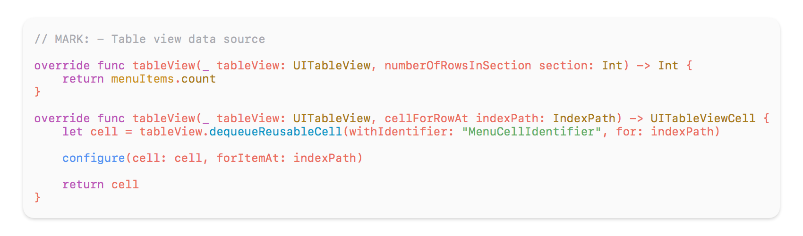

# One Dark Light Atom theme for Xcode

## Installation

### Manually
1. Copy the theme to the Xcode's `FontAndColorThemes` folder (`~/Library/Developer/Xcode/UserData/FontAndColorThemes/`).
2. Restart Xcode.
3. Enjoy.

### ThemeInstaller app
Find and install [ThemeInstaller](http://www.apptorium.com/products/themeinstaller) app from the Mac App Store. Open theme you want to install and it's done. Themes are visible after Xcode is restarted.
